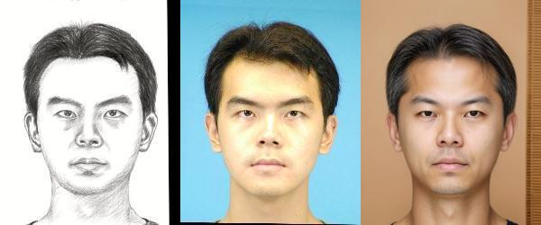
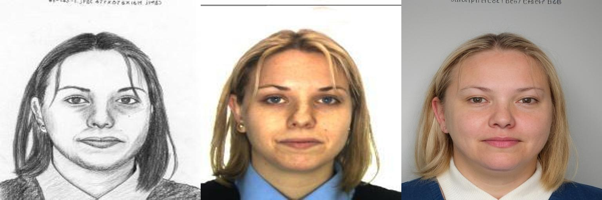
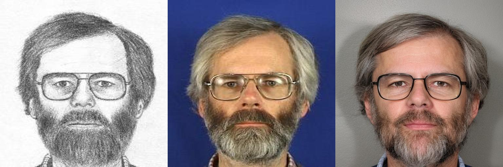

# Sketch-to-Photo Generation using ControlNet

## Overview

This repository implements a pipeline for converting forensic or hand-drawn sketches into realistic facial images using ControlNet-based diffusion models. It also includes an evaluation module that verifies identity similarity between generated images and real photos using facial recognition.

---

## Repository Structure

```
.
├── main.py
├── test.py
├── media/                 # Assets, diagrams, or documentation images
├── results/               # Generated outputs
├── test_dataset/
│   ├── clinical_desc/     # Textual descriptions (if used)
│   ├── generated_photos/  # Model outputs
│   ├── test_photos/       # Ground truth images
│   └── test_sketches/     # Input sketches
├── requirements.txt
├── pyproject.toml
├── uv.lock
└── README.md
```

---

## Features

* Sketch-to-photo generation using ControlNet
* Multiple conditioning modes (lineart, canny, scribble)
* Realistic face synthesis using high-quality pretrained models
* Identity verification using facial recognition
* Managed environment using **uv (Astral)**
* You can download complete dataset folowing [dataset.md](test_dataset/dataset.md)

---

## Setup Instructions

### 1. Install uv (Astral)

```bash
pip install uv
```

### 2. Create Environment & Install Dependencies

```bash
git clone https://github.com/rachit6105/Sketch-2-Image.git
cd Sketch-2-Image
uv sync
```

This will:

* Create a virtual environment (`.venv`)
* Install all dependencies from `pyproject.toml` / `uv.lock`


#### Alernatively you can also do this for doing a manual installation

```bash
python -m venv VENV_NAME
pip install -r requirements.txt
```

### 3. Activate Environment

```bash
source .venv/bin/activate
```
---

## Usage

### Generate Image from Sketch

```bash
python main.py 
```

---

### Evaluate Identity Match

```bash
python test.py --n 148
```

Output:

* Similarity score - Cosine and Euclidean distance
* Match / Non-match result

---

## Example Results

An inference run looks like this with real.jpg for testing or signifying the police database:

```
test_dataset/
├── sketch.png
├── description.txt
├── real.jpg
```

Then display:

### Output
> This shows the sketch, ground truth and generated images respectively.




---

## Limitations

* Limited dataset size
* Identity drift in generated faces
* Sensitive to sketch quality
* You can read [this](research/research.md) to see my failed attempts and tests.

## Future Work

* Larger dataset
* Better identity-preserving constraints
* Fine-tuning ControlNet for forensic sketches


## Acknowledgements

* ControlNet
* Stable Diffusion
* InsightFace
* Realistic Vision
